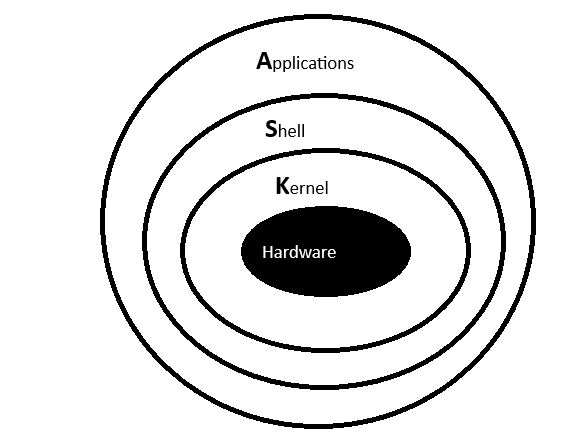

# Linux Architecture

**Application** :-Applications are programs like Word, Paint, and Notepad that users use to perform tasks.

**Shell** :-The shell acts as a bridge between the user and the kernel by taking commands and passing them to the kernel.

**Kernel** :-The kernel is the heart of the operating system. It controls the CPU, memory, and hardware devices.

# How Processes Are Created and Managed

- **What**:  
  A process is a program in execution (a running program).
  
- **Why**:  
  The operating system uses processes to:
  - Run multiple programs at the same time  
  - Keep the system stable and organized
     
- **How**:  
  - A user runs a command  
  - The kernel creates a process  
  - The kernel assigns CPU time and memory  
  - The process ends when its work is completed
  
## Process States:-
- **New** :- Process is just created.
- **Running** :- Process is executing on CPU
- **Waiting/Sleeping** :- Process is waiting for input(keyboard , disk , network)
- **Terminated** :- Process has finished or is killed.
- **Zombie** :- A process that has finished execution , but its entry still exists in the system.

## Process Management Commands
- **ps** → Shows running processes  
- **top** → Displays live process information  
- **htop** → Interactive and enhanced process viewer  
- **kill PID** → Stops a process using its PID  
- **nice** → Sets the priority of a process at start  
- **renice** → Changes the priority of a running process  
- **bg** → Runs a stopped process in the background  
- **fg** → Brings a background process to the foreground

# What systemd does and why it matters
- **What** :- Systemd(or init) is the first process started by te kernel (pid=1)
- **Why** :- System needs a manager to keep services running.
- **How** :- Starts during boot
  - Launches system services like network , ssh , docker.
  - Monitors and restarts failed services.

# List 5 commands you would use daily
- **ls** :- used to list the files in a directory
- **cd** :- used to navigate from one location to another
- **pwd** :- used to print present working directory
- **ps** :- shows running processes
- **mkdir** :- used to create a directory 

