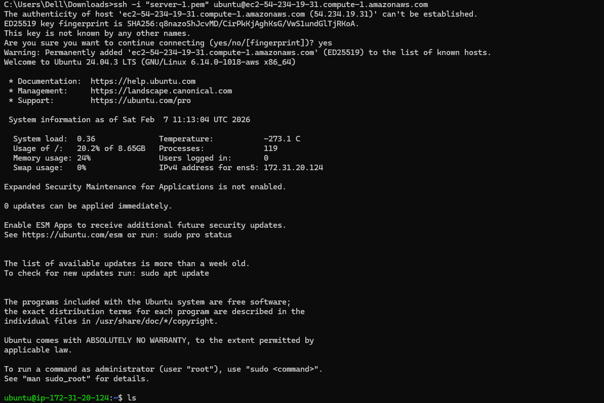
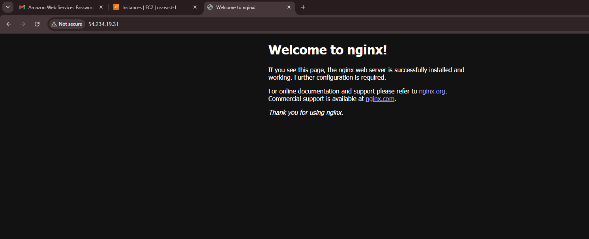

# Day 08 – Cloud Server Setup: Docker, Nginx & Web Deployment
## Screenshots
### Screenshot of ssh_server connection



### Screenshot of nginx home page access from webbrowser



### Link to the logs.txt file
[view logs](logs.txt)

### Commands Used
```bash
apt-get update
apt install nginx
systemctl start nginx
systemctl enable nginx
systemctl status nginx
journalctl -u nginx
touch logs.txt
journalctl -u nginx > logs.txt
cat logs.txt
#In local 
scp -i server-1.pem ubuntu@54.234.19.31:~/logs.txt .
```


# Challenges Faced
## Challenge (I was not able to download the logs.txt to my local)
## How I sloved 
1. First i got confused wheather to use public ip or private ip then i realized to send any file outside the server we have to use public ip.
2. Then second mistake i was doing was running the scp command in my ubntu server itself
3. Then I got knwon that we have to run scp command on the machine where we want to receive the file. I then runned it on local machine
4. In scp command I missed . then caused error , then i understood the scp command synstax I runnned it again it finally worked. 

## What I Learned
1. I learned to first how to redirect or save the output of a command to a file using ">" sysmbol
2. I learned whenever we want to send a file outside our server we have to use public ip only private ip will in used in vpc scenarios 
3. scp command should always be runned on the machine which has to receive the file.
