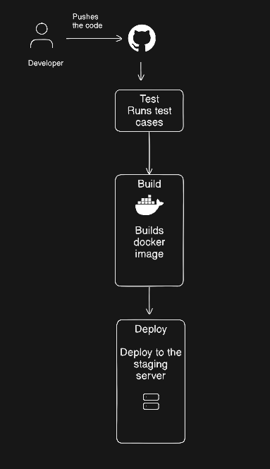

# Task-1
## Scenario:
- A team of 5 developers push code to the same repository and manually deploy to production.
### 1. What can go wrong?
- Code conflicts – multiple developers push changes at the same time.
- Human errors – someone may run the wrong command or deploy the wrong version.
- Missing steps – manual deployment may skip some steps (build, tests, restart service).
- Downtime risk – if deployment fails, the application may stop working.
- Inconsistent environments – different machines may have different dependencies or configurations.
### 2. What does "It works on my machine" mean and why is it a real problem?
"It works on my machine" means the code runs correctly on a developer's local system but fails on another developer's system or on the production server.
This happens because:
- Different software versions
- Missing dependencies
- Different OS configurations
- This is a real problem because it causes unexpected failures in production, delays debugging, and wastes development time.
### 3. How many times a day can a team safely deploy manually?
- Usually 1–2 times per day at most.
- Manual deployments take time and have a higher risk of mistakes.
- That is why teams use CI/CD pipelines (Jenkins, GitHub Actions, GitLab CI) to automate builds, testing, and deployment so they can deploy many times a day safely.
# Task-2
## 1. Continuous Integration (CI)
Continuous Integration is the practice where developers frequently merge their code into a shared repository (often multiple times a day).
Each time code is pushed, an automated build and tests run to detect errors early.
### What it catches:
- Code conflicts
- Build failures
- Failed tests

Real-world example:

A developer pushes code to GitHub → GitHub Actions/Jenkins automatically runs build and tests to ensure the code works.

## 2. Continuous Delivery (CD)
Continuous Delivery means that after CI completes successfully, the application is automatically prepared for release to production, but the actual deployment requires manual approval.

### What “delivery” means:
The software is always ready to be deployed, but someone decides when to release it.

Real-world example:
Code passes CI tests → the pipeline builds a Docker image and stores it in a registry, ready for deployment when the team approves.

## 3. Continuous Deployment

Continuous Deployment goes one step further than Continuous Delivery.
If the code passes all automated tests, it is automatically deployed to production without human approval.

When teams use it:
Teams with strong automated testing and monitoring systems.

Real-world example:
A developer pushes code → CI tests pass → pipeline automatically deploys the new version to Kubernetes in production.

# Task-3
- Trigger — The event that starts the pipeline, such as a code push, pull request, or scheduled run.
- Stage — A major phase in the pipeline like build, test, or deploy.
- Job — A set of tasks executed together inside a stage.
- Step — A single command or action performed inside a job.
- Runner — The machine or server that executes the pipeline jobs.
- Artifact — The output produced by a job, such as build files, packages, or Docker images.

# Task-4

# Task-5
## GitHub Actions Workflow Analysis – facebook/react
### 1. What triggers it?

This workflow is triggered when a pull request is opened or marked ready for review.

It only runs if the pull request modifies:

files inside the compiler/ folder

workflow files starting with compiler_ inside .github/workflows/.

## 2. How many jobs does it have?

The workflow has 3 jobs:

- check_access
- check_maintainer
- notify

## 3. What does it do? (Best guess)

This workflow checks who created the pull request and whether they are allowed contributors.

- check_access
  Checks if the PR author is a member or collaborator of the repository.

- check_maintainer
  Verifies whether the contributor is part of the React core team or maintainer.

- notify
  If the PR is from a core team member, it sends a notification to a Discord channel using a webhook.
