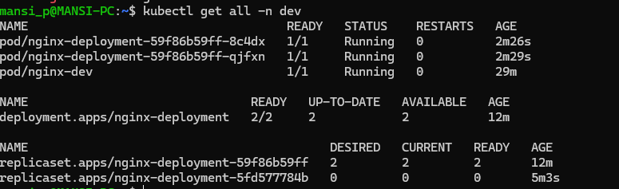

# What namespaces are and why you would use them
- Namespaces are used to divide a Kubernetes cluster into multiple logical environments.
- Why we use them:
  - Organization → Group related resources
  - Isolation → Separate environments (dev, test, prod)
  - Access Control → Restrict user permissions
  - Resource Management → Apply quotas and limits
  - Avoid Conflicts → Same resource names can exist in different namespaces
# Your Deployment manifest and an explanation of each section
``` bash
---
apiVersion: apps/v1
kind: Deployment
metadata:
  name: nginx-deployment
  namespace: dev
  labels:
    app: nginx
spec:
  replicas: 3
  selector:
    matchLabels:
      app: nginx
  template:
    metadata:
      labels:
        app: nginx
    spec:
      containers:
        - name: nginx
          image: nginx:latest
          ports:
            - containerPort: 80
```
## 1. apiVersion: apps/v1
- Tells Kubernetes which API version to use
- apps/v1 is used for Deployments
## 2. kind: Deployment
- Defines the type of resource
- Deployment is used to manage Pods and keep them running
## 3. metadata
- Basic details about the Deployment
  - name: nginx-deployment → Name of the Deployment
  - namespace: dev → Deployment will be created in dev namespace
  - labels: app: nginx → Used for grouping and identification
## 4. spec (Main Configuration)
  ### a) replicas: 3
  - Tells Kubernetes to run 3 Pods
  - If one Pod fails, Kubernetes will recreate it
  ### b) selector
``` bash
selector:
  matchLabels:
    app: nginx
```
  - Used to identify which Pods belong to this Deployment
  - It matches Pods having label app: nginx
## 5. template (Pod Definition)
- This is the blueprint of the Pod that will be created
  ### a) metadata (inside template)
``` bash
labels:
  app: nginx
```
  - Labels assigned to Pods
  - Must match the selector
### b) spec (inside template)
- Defines container details
``` bash
containers:
  - name: nginx
    image: nginx:latest
    ports:
      - containerPort: 80
```
  - containers: List of containers
  - name: nginx → Container name
  - image: nginx:latest → Docker image used
  - containerPort: 80 → Application runs on port 80
# What happens when you delete a Pod managed by a Deployment vs a standalone Pod
- Pod managed by Deployment
  - → Kubernetes automatically recreates the Pod to maintain the desired number of replicas
- Standalone Pod
  - → Pod is permanently deleted and not recreated
# How scaling works (both imperative and declarative)
## 1. Imperative Scaling
- Scaling is done using a direct command.
  
Example
``` bash
kubectl scale deployment nginx-deployment --replicas=5
```
- You manually tell Kubernetes to change the number of Pods
- Kubernetes immediately creates or deletes Pods to match the number
## 2. Declarative Scaling
- Scaling is done by updating the YAML file.

Example
``` bash
spec:
  replicas: 5
```
- You define the desired number of replicas in YAML
- Kubernetes compares current state with desired state
- Automatically adjusts Pods to ma
# How rolling updates and rollbacks work
## 1. Rolling Updates
- A rolling update is a way to update an application without downtime by gradually replacing old Pods with new ones.
- Kubernetes creates new Pods with the updated version
- At the same time, it terminates old Pods step by step
- This ensures the application is always available
## 2. Rollbacks
- Rollback means reverting to a previous version of the Deployment if something goes wrong.
- Kubernetes keeps a history of Deployment revisions
- You can switch back to the previous working version
# Screenshot of pods and deployment


